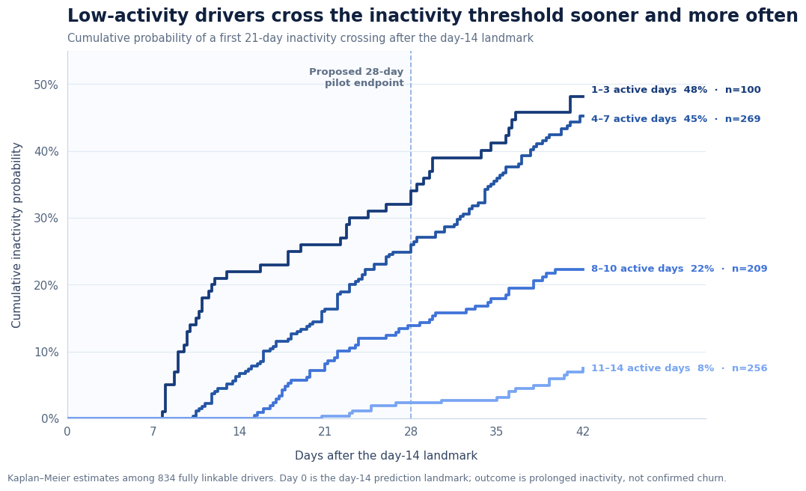
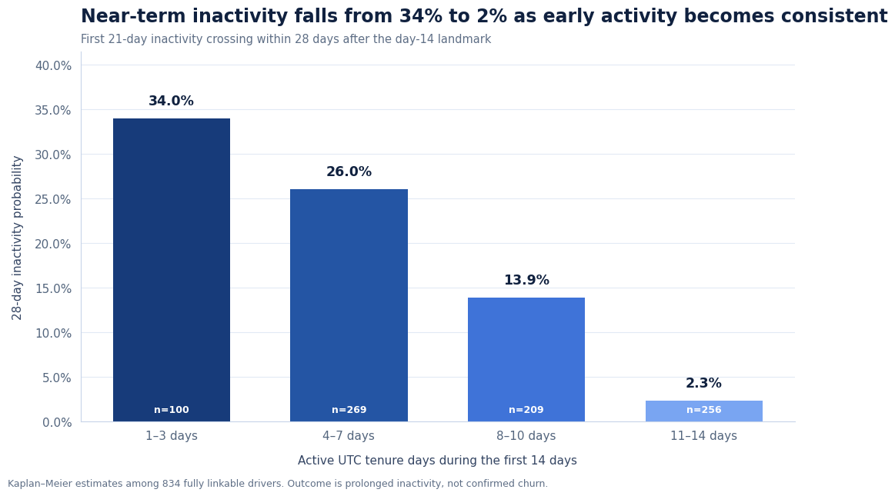
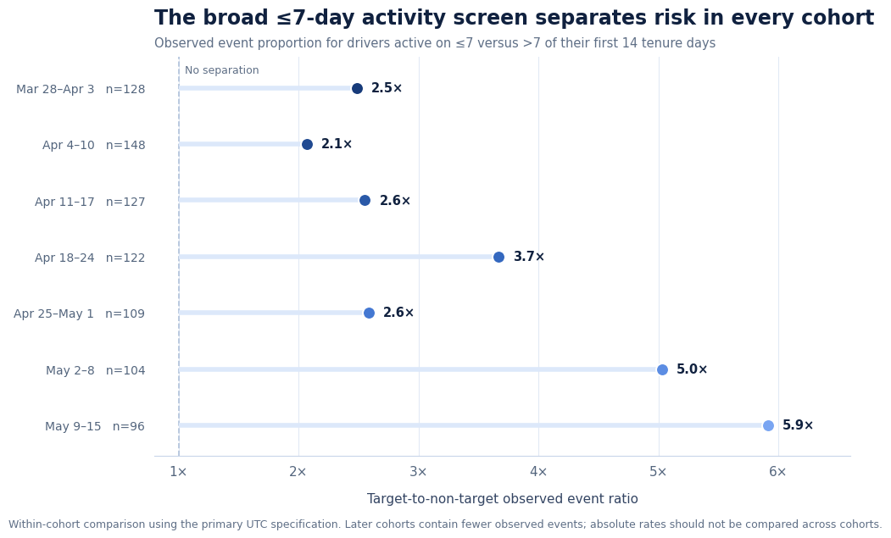
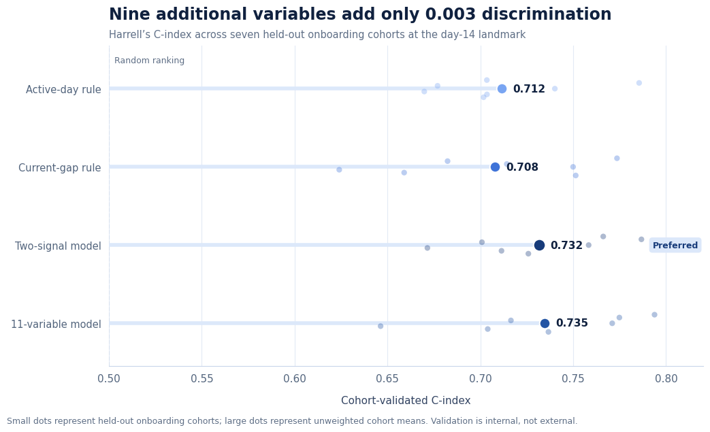
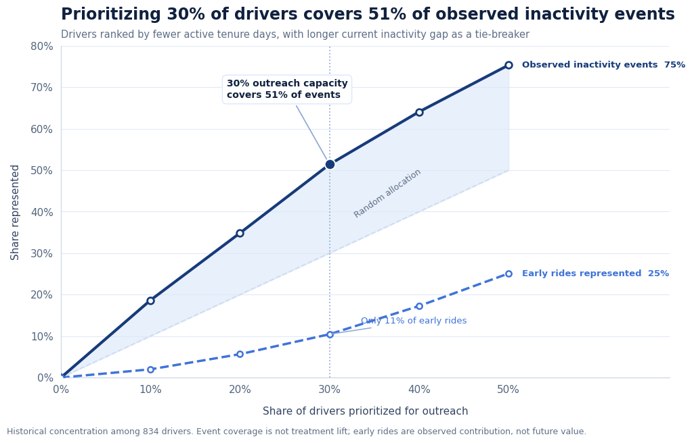

# Prioritizing Early Driver Retention: A Risk-Based Pilot Recommendation
 
**To:** Head of Driver Operations / Driver Growth
**From:** Yesha Mandaliya
**Re:** Whether and how to focus early retention outreach on newly onboarded drivers
**Scope:** A study of the 2016 Lyft San Francisco driver data. This is a historical case study demonstrating the method — **not** a recommendation for today's operations.
 
---
 
## Bottom line
 
Lyft should run a **small, controlled test (a pilot)** of early retention outreach, starting with drivers who were **active on 4–7 of their first 14 days** - about a third of new drivers, but nearly half of everyone who later goes quiet. Lyft should **not** roll out a company-wide targeting program yet. The data reliably tells us *who is at risk of going quiet*; only a controlled test can tell us *whether outreach actually changes their behavior* - and *whether focusing on a group beats simply contacting everyone*.
 
The good news for execution: two simple signals - **how many days a driver was active in their first two weeks**, and **how long they've been idle by day 14** - predict future inactivity just as well as a complex 11-variable model. So the recommendation is a simple, explainable rule plus a clean experiment, not a black box.
 
---
 
## The decision this answers
 
Reaching out to new drivers takes real time and money, so Lyft can't treat every driver the same way. If early behavior clearly flags who is likely to drift away, Lyft can focus its limited attention where it matters most.
 
The honest boundary: this data has no record of anyone actually being contacted, no costs, and no rider side. So it can tell us **where to focus and what to test** - but it *cannot* prove that outreach works, saves rides, or pays for itself. This memo stays inside that line.
 
---
 
## What the data shows
 
**1. Drivers who start slow go quiet sooner and more often.**
Tracking each driver from their 14th day, the chart below shows how quickly different groups hit a first **21-day stretch with no rides**. Drivers active on only a few of their first 14 days climb fastest.
 

*The fewer days a driver was active early on, the sooner and more often they later go quiet. "Going quiet" is a re-engagement signal, not confirmed churn - about a third of these drivers come back on their own.*
 
**2. Early activity is a strong, simple risk flag.**
Grouping drivers by how many of their first 14 days they were active, the chance of going quiet within the next month drops sharply - from 34% for the least active to just 2% for the most consistent.
 

*Risk of going quiet within 28 days, by how many days a driver was active in their first two weeks.*
 
**3. This risk flag is concentrated and dependable.**
Drivers active on **7 or fewer** of their first 14 days are 44% of drivers but account for **70%** of everyone who goes quiet. That gap holds in every weekly group of new drivers we looked at — the at-risk group is consistently 2–6× more likely to go quiet.
 

*In all seven weekly onboarding groups, the "7-or-fewer-active-days" group is far more likely to go quiet than everyone else.*
 
**4. A simple rule works as well as a complex model.**
We compared four approaches. A simple two-signal rule scores essentially the same as an 11-variable model. Adding nine more variables improves accuracy by a negligible 0.003 and isn't even consistent across groups - so the complexity isn't worth it.
 

*Higher is better (0.50 = a coin flip, so ~0.71–0.73 means the rule correctly ranks who's more at risk roughly 71–73% of the time). The simple two-signal model is the sensible choice.*
 
One honest caveat: 0.71 is a *useful* flag, not a crystal ball. It points to the right people more often than not, but many flagged drivers won't go quiet, and some quiet drivers come back on their own. This is a way to **focus attention**, not a precise prediction of individuals.
 
---
 
## Recommendation: test first, don't roll out
 
**Run a controlled test.** Split eligible drivers evenly into an outreach group and a do-nothing-different (control) group at day 14, then compare.
 
- **Start with the 4–7-active-day group.** It's the sweet spot: enough drivers who go quiet to measure a real effect, and drivers who've shown genuine early engagement (so they're worth keeping).
- **What we'd measure:** the difference in how many go quiet within 28 days, outreach group vs control.
- **Sort drivers by how long they've been idle** (under 3 / 3–7 / 7–14 days) so we can see if the very-idle respond differently.
- **Also include smaller test groups from the other activity levels.** Without an outreach-vs-control comparison *outside* the main group, we can't tell whether focusing on a group is actually better than contacting everyone - that's the whole question.
**The capacity view (how to spend limited outreach):** if Lyft can only reach a slice of drivers, focusing on the riskiest 30% covers about half of all the drivers who go quiet.
 

*Reaching the riskiest 30% of drivers covers 51% of the people who later go quiet — but note those drivers represent only ~11% of early rides, so risk and current contribution don't line up. There's no single "right" cutoff without cost and capacity numbers.*
 
**In the meantime (optional, low-cost only):** cheap, reversible outreach can start with the 4–7-active-day drivers who are already idle 3+ days by day 14 (the highest-risk slice, ~39% go quiet). Treat this as a temporary rule of thumb — not a reason to spend on incentives.
 
**Scale only if the test proves it's worth it.** A 10-point drop in inactivity (from 26% to 16%) would be a big result. Being statistically real isn't enough — the effect has to be big enough to justify the cost.
 
---
 
## What we can and can't say
 
**We can say:** where inactivity concentrates; a smart group and setup for a test; a temporary low-cost focus list; and how much of the problem different outreach budgets would cover.
 
**We cannot say:** that outreach prevents inactivity, saves rides, or pays off; that the highest-risk drivers are the most *reachable*; that focusing beats contacting everyone; that incentives are justified; or that these 2016 findings apply to Lyft today.
 
---
 
## What we need from the business to finalize the test
 
A specific outreach action to test; how many eligible drivers there are now; how many we can actually reach; cost per driver contacted; the value of keeping a driver active; the smallest result worth acting on; and what "normal" contact already happens today. With those, we finalize the test size and launch. If those numbers aren't available, the right move is to stop at "run the test" — not to make them up.
 
---
 
*Note: any "ride value" figures in the supporting analysis are estimated fares from the published rate card — never actual driver take-home pay. Full details, checks, and sensitivity analyses are in the accompanying notebook.*
